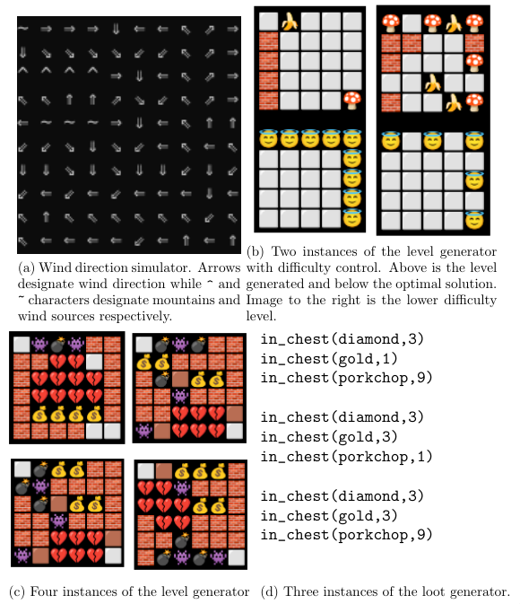

# Introduction

Code examples related to the work in "Investigating Applicability Heuristics of Answer Set Programming in Game Development: Use Cases and Empirical Study"

# Contents

- `examples`: Examples from inside the thesis.
- `participants`: Some of the projects created using ASP by study participants.

